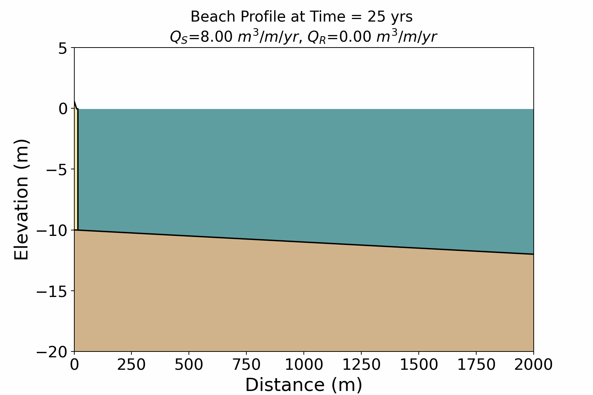

# Beach-Ridge

[]()
[]()

A numerical model for simulating beach ridge development during relative sea-level (RSL) fall, based on a modified 2D cross-shore sediment partitioning framework.



## Overview

Beach-Ridge is a reduced-complexity, process-informed model built to explore how autogenic and environmental forcings shape uplifted beach ridge morphology. It extends the Subaerial Barrier Sediment Partitioning (SBSP) framework of Ciarletta et al. (2021) to simulate ridge morphology and progradation under falling RSL conditions. Rather than resolving full hydrodynamic processes, the model represents ridge evolution through simplified geometric relationships and prescribed sediment fluxes — making it computationally efficient and well-suited for long-timescale sensitivity analyses.

## Getting Started

### Step 1 — Download this repository

Clone or download this repository to your local machine:

```bash
git clone https://github.com/emilyhuffman/Beach-Ridge.git
cd beachridge
```

### Step 2 — Create a virtual environment

We recommend using **Anaconda** to manage dependencies. The instructions below assume Anaconda3 is installed and running on your machine.

Open the **Anaconda Prompt** (Windows) or a terminal (Mac/Linux) and navigate to the repository folder:

```bash
cd path/to/beachridge
```

Create a new environment from the provided `environment.yml` file:

```bash
conda env create -f environment.yml -n beachridge_env
```

Then activate it:

```bash
conda activate beachridge_env
```

> ⚠️ Remember to activate the environment each time you start a new session.

### Step 3 — Run the notebook

With the environment active, launch Jupyter:

```bash
jupyter notebook
```

A browser window will open. Navigate to and open `beach_ridge_main.ipynb` and run the cells sequentially.

## References

- Ciarletta, D. J., Miselis, J. L., Shawler, J. L., & Hein, C. J. (2021). Quantifying thresholds of barrier geomorphic change in a cross-shore sediment-partitioning model. Earth Surface Dynamics, 9(2), 183–203. https://doi.org/10.5194/esurf-9-183-2021
- SBSP Model code: https://doi.org/10.5281/zenodo.2575699
